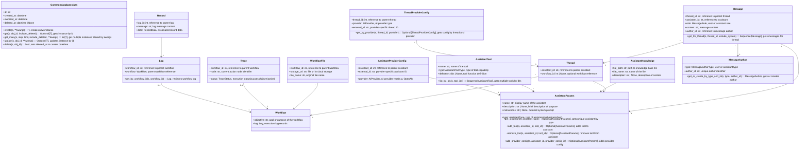

```mermaid
classDiagram
    %% Base Classes
    class Common database class {
        +id: int
        +created_at: datetime
        +modified_at: datetime
        +deleted_at: datetime | None
        +create(s, **kwargs): T, creates new instance
        +get(s, obj_id, include_deleted): Optional[T], gets instance by id
        +get_many(s, skip, limit, include_deleted, **kwargs): list[T], get multiple instances filtered by kwargs
        +update(s, obj_id, **kwargs): Optional[T], updates instance by id
        +delete(s, obj_id): bool, sets deleted_at to current datetime
    }

    %% Workflow Models
    class Workflow {
        +objective: str, goal or purpose of the workflow
        +log: Log, execution log records
    }

    class Log {
        +workflow_id: int, reference to parent workflow
        +workflow: Workflow, parent workflow reference
        +get_by_workflow_id(s, workflow_id): Log, retrieves workflow log
    }

    class Record {
        +log_id: int, reference to parent log
        +message: str, log message content
        +data: RecordData, associated record data
    }

    class Trace {
        +workflow_id: int, reference to parent workflow
        +node: str, current action node identifier
        +status: TraceStatus, execution status (success/failure/active)
    }

    class WorkflowFile {
        +workflow_id: int, reference to parent workflow
        +storage_url: str, file url in cloud storage
        +file_name: str, original file name
    }

    %% Assistant Models
    class AssistantParams {
        +name: str, display name of the assistant
        +type: AssistantType, type of assistant (orchestrator/test)
        +description: str | None, brief description of purpose
        +instructions: str | None, detailed system prompt
        +get_singleton(s, assistant_type): Optional[AssistantParams], gets unique assistant by type
        +add_tool(s, assistant_id, tool_id): Optional[AssistantParams], adds tool to assistant
        +remove_tool(s, assistant_id, tool_id): Optional[AssistantParams], removes tool from assistant
        +add_provider_config(s, assistant_id, provider_config_id): Optional[AssistantParams], adds provider config
    }

    class AssistantProviderConfig {
        +assistant_id: int, reference to parent assistant
        +provider: AIProvider, AI provider type (e.g. OpenAI)
        +external_id: str, provider-specific assistant ID
    }

    class AssistantTool {
        +name: str, name of the tool
        +type: AssistantToolType, type of tool capability
        +definition: dict | None, tool function definition
        +list_by_ids(s, tool_ids): Sequence[AssistantTool], gets multiple tools by IDs
    }

    class AssistantKnowledge {
        +file_path: str, path to knowledge base file
        +file_name: str, name of the file
        +description: str | None, description of content
    }

    class Thread {
        +assistant_id: int, reference to parent assistant
        +workflow_id: int | None, optional workflow reference
    }

    class ThreadProviderConfig {
        +thread_id: int, reference to parent thread
        +provider: AIProvider, AI provider type
        +external_id: str, provider-specific thread ID
        +get_by_provider(s, thread_id, provider): Optional[ThreadProviderConfig], gets config by thread and provider
    }

    class Message {
        +thread_id: int, reference to parent thread
        +assistant_id: int, reference to assistant
        +role: MessageRole, user or assistant role
        +content: str, message content
        +author_id: int, reference to message author
        +get_for_thread(s, thread_id, include_system): Sequence[Message], gets messages for thread
    }

    class MessageAuthor {
        +type: MessageAuthorType, user or assistant type
        +author_id: int, unique author identifier
        +get_or_create_by_type_and_id(s, type, author_id): MessageAuthor, gets or creates author
    }

    %% Inheritance and Relationships

    Log "0..1" --> "1" Workflow
    Record "*" --> "1" Log
    Trace "0..1" --> "1" Workflow
    WorkflowFile "*" --> "1" Workflow
    Thread "*" --> "1" Workflow

    AssistantProviderConfig "*" --> "1" AssistantParams
    AssistantTool "*" --> "*" AssistantParams
    AssistantKnowledge "*" --> "*" AssistantParams
    Thread "*" --> "1" AssistantParams
    Message "*" --> "1" AssistantParams

    ThreadProviderConfig "*" --> "1" Thread
    Message "*" --> "1" Thread
    Message "*" --> "1" MessageAuthor

```
